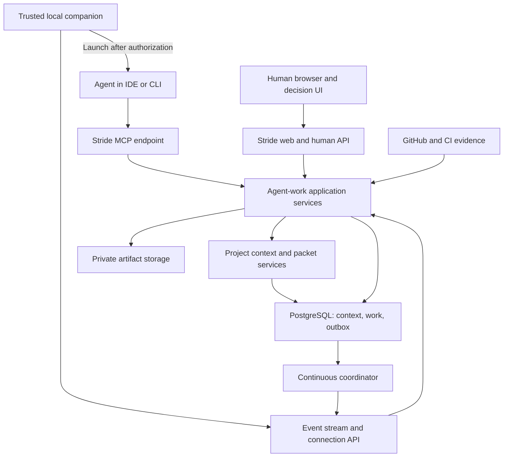

# Technical architecture

Status: proposed. Extend the current modular monolith; use separate processes where connection lifetime and execution risk require them.

## Runtime boundaries

The web/MCP adapters may initially share the Next.js application deployment with separate authentication handlers. A continuous coordinator process from the same codebase handles dispatch, leases and event delivery. Host persistent event streams on a runtime verified to support their lifetime; use the coordinator service when web-host limits require it. Each endpoint has its own resource/audience policy.

The existing five-minute reminder job is not the realtime dispatcher. Do not run model execution, repository builds or untrusted code inside the production web or coordinator container. Attended agents execute on their operator's machine. Optional managed runners are a later isolated execution tier.

Dependencies point from UI/HTTP/MCP to application services, to domain policies and repository ports. Vendor SDKs sit in adapters. The core does not depend on Claude, Codex, Gemini or an IDE extension.

[Project context](PROJECT_CONTEXT.md) is an execution dependency: it owns requirement versions, adopted decision pointers, source reconciliation, immutable snapshots, task manifests and impact rules. GitHub remains authoritative for observed code; humans publish accepted intent. Packet assembly is a deterministic application service. Optional model-derived summaries never become the authority for claims or acceptance.

Suggested new boundaries within the existing layout:

| Module | Responsibility |
| --- | --- |
| `lib/agent-work/domain/` | State transitions, eligibility, approval validity, dependency and evidence rules |
| `lib/agent-work/application/` | Enroll, propose, assign, authorize, claim, submit, accept and revoke use cases |
| `lib/agent-work/persistence/` | Tenant-scoped SQL, transactions, versions, leases and outbox |
| `lib/agent-work/adapters/` | MCP mapping, notification transport, GitHub evidence and runtime contracts |
| `lib/agent-work/context/` | Source authority, requirement revisions, packet assembly, freshness/impact policies and indexed traceability |
| `app/` and `components/stride/` additions | Human decisions and task contribution views |
| `packages/stride-cli/`, later `packages/stride-vscode/` | Small independently packaged clients sharing versioned contracts |
| `scripts/agent-coordinator.ts` | Bounded continuous job loop with graceful shutdown |

Paths are proposed, not created application components. Avoid a framework migration or a microservice per role.

## Compatibility with existing tasks

Existing task creators, updaters, comment authors and activity actors are human user foreign keys. Existing repository mutations accept a human user ID. Passing an agent operator's ID to those methods would falsely attribute agent work to a person.

Introduce an additive **agent-work aggregate**:

- Human tickets retain their human owner and existing fields.
- `ticket_proposals` record agent-created candidate tickets with true authorship. Human acceptance creates a legacy task as a genuine human action, cross-linked to its proposal and decision.
- Actor-aware `work_items` under a ticket represent design, development, review and testing. Agents can propose these directly; accepted plans authorize their scope, not execution.
- Agent events and discussions use the new actor model. The human timeline combines legacy human activity and agent-work events without rewriting history.
- Existing human notification records are not populated with a fake human actor. Add agent decision notifications with actor-aware references and combine them in the recipient-scoped inbox read model.

Use a server-constructed `ActorContext` discriminated as human, agent or system. An agent context includes profile, connection, delegating human grant, workspace/project scope and permission epoch. An optional active attempt adds approved packet revision and fencing epoch. Never construct authority from submitted `agent_id`, owner or role fields.

The human task-completion service must check current agent-work gates for opted-in tickets. Route every completion path through it, including bulk updates, recurrence, alternate APIs and restoration/reopening behavior. This is the deliberate compatibility seam; merely hiding the Done button is insufficient. Generalized direct agent writes to legacy tasks are deferred until an actor-aware migration is justified.

## Data aggregates and invariants

| Aggregate / records | Required invariants |
| --- | --- |
| Profiles, connections, role bindings | One current human operator; explicit project grants; connection credential maps to one profile; revocation epoch |
| Repository bindings | Approved repository identity, base-ref policy, provider installation and execution constraints |
| Ticket proposals, plans and work items | Tenant-scoped parentage; immutable accepted plan/packet revisions; one role per work item; explicit accountable human |
| Dependencies | Same approved plan/project initially; acyclic; bounded fan-out and depth; gate types specify accepted artifact or verified candidate |
| Assignment offers and start authorizations | One selected profile per offer; exact packet/profile/operator/policy binding; expiration and one attempt consumption |
| Attempts and leases | At most one active attempt per work item; default one per profile; monotonically increasing fencing epoch |
| Artifacts, findings and human decisions | Immutable versions and hashes; source/candidate revision; evidence origin; supersession and decision provenance |
| Work events, outbox and delivery receipts | State/event committed together; monotonic aggregate version; deduplicated delivery |
| Idempotency receipts | Unique scoped operation key and request hash; replay returns original result; changed input is rejected |
| Requirements, adopted decisions and context proposals | One authority per record type; immutable accepted revisions; versioned human publication and conflict resolution |
| Source observations and reconciliation cursors | Exact repository/branch/revision, bounded coverage and ordered refresh generations; partial indexing is explicit |
| Context snapshots, manifests and run bindings | Immutable source selection; current access checks; material alignment and policy epochs required for execution |
| Checkpoints and context read/adoption receipts | Attributed handoff evidence and declared packet adoption; no claim of model comprehension or complete local visibility |

These are logical groups, not a requirement for one service per table. Use PostgreSQL composite tenant foreign keys, foreign-key-backed actor references, partial unique indexes for active attempts/offers and compare-and-swap record versions. Every query binds the authenticated tenant and project. Never rely on an unguessable UUID for access control.

Dependency types distinguish an available submitted artifact, a verified integration candidate and human-accepted work. In an accepted plan, review/QA may depend on the submitted candidate and CI, while final acceptance depends on their reports. Requiring developer acceptance before the review needed to accept that same development would deadlock the workflow. Changing a candidate re-evaluates and invalidates the dependent evidence transactionally.

## Dispatch, authorization and claims

1. Accept or update a bounded plan/work item in a transaction with its work event and outbox entry.
2. The coordinator finds accepted work with satisfied dependencies, no active attempt and available policy limits. Serialize plan expansion to prevent concurrent cycle/fan-out violations.
3. Choose a profile deterministically: approved role/capability, access, availability and capacity, followed by priority/age and a fair tie-break. Prefer continuity only within these rules. No LLM selects permissions.
4. Create one expiring assignment offer. Notify that profile's operator. Reserve no execution lease while a human considers the request.
5. Assemble a complete context manifest from verified mandatory sources. A human decision binds the packet/manifest, profile, connection selection policy, repository base SHA, requirement/role/policy versions, permitted actions and limits. Selection of a different profile or material change requires another authorization.
6. Claim atomically checks current material context and policy versions, consumes an eligible authorization, reserves profile/workspace capacity, creates one attempt and lease, and establishes run-scoped authority. Required context must be acknowledged by the attended agent or prepared for launch by the trusted adapter as specified in CONTEXT_PROTOCOL.md. Deliver any separate run credential outside model-visible tool results. Simultaneous claimers must produce one winner. A retry with the same idempotency key returns that attempt, not a new run.
7. Only then may the companion launch work. Its durable launch receipt keys on attempt ID; a lost response must not start a second process. A generic MCP host can claim from an already human-started session; that process may report progress only after the claim.
8. Heartbeats extend a live lease. Submission stores immutable artifacts and moves work to review, releases execution capacity and notifies the reviewer. Submission, verified CI and human acceptance each unlock only their explicitly defined dependency types.

An offer is a suggestion, not execution ownership. If an approved agent is offline, show that condition; do not transfer its authorization to another profile. A replacement attempt needs a new authorization. Resuming a paused attempt is allowed only while its original scope and policy remain valid and its lease/authorization renewal rules are satisfied; otherwise create a new attempt.

Lease renewal is the companion's or a verified host adapter's responsibility, independent of the model's tool-call cadence. Do not require an LLM to remember a heartbeat while it runs a long test. A plain MCP connection without an execution watcher can browse/propose; enable run claims only after a watcher is attached. The watcher reports process/attended-session contact, not proof of productive work. Bind it to the enrolled connection and attempt, and cap total runtime regardless of heartbeat activity.

A clarification pauses execution while preserving the current reservation for at most ten minutes by default and never beyond the packet's runtime deadline. If the watcher, lease or waiting deadline expires, relinquish the attempt and require a new start decision. An answer can resume a live paused attempt only when it does not expand its scope. Starting a replacement attempt can be combined with answering in one clearly labeled human decision.

## Events and recovery

Use a PostgreSQL transactional outbox first. Multiple coordinators claim bounded batches with row locks and job leases. Wake hints such as database notifications are optional; periodic reconciliation is authoritative. Do not hold a database transaction during an external call or stream connection.

Application event delivery is at least once. Consumers deduplicate by event ID and aggregate version; external operations use a receipt/idempotency contract. Modern MCP subscriptions are change hints; durable catch-up uses a Stride application cursor. An optional application SSE stream may carry the same recipient-scoped cursor, but this is not MCP transport replay. If replay retention expires, return an explicit resync requirement and fetch a current authorized snapshot. Older events cannot roll a current UI backward. See CONTEXT_PROTOCOL.md for the 2026-07-28 transport distinction.

Expired attempts lose authority immediately at the server. Every consequential write checks the current fencing epoch and lease using database time. Late artifacts are quarantined for human comparison, never promoted as the current result. Audit the late submission without leaking revoked project content back to the caller.

Agent-reported progress and heartbeats are different records. A healthy connection cannot manufacture task progress. Error, stop and approval states are persisted so reconnecting clients can reconstruct them.

## Code and evidence

Give each implementation attempt a distinct branch and worktree or isolated checkout. Pin repository identity and base SHA in its packet. Do not let two agents edit one working directory. Branch ownership hints help routing but do not prevent Git conflicts.

An integration owner produces a candidate commit from parallel contributions. Capture CI checks and peer/QA reports against that exact commit. New commits invalidate downstream candidate decisions. Gate results include check identity, source, timestamp, artifact hash and candidate SHA. Agent text saying “tests passed” is a report, not verified CI evidence.

Prefer GitHub commit/PR references and bounded structured reports. If storing new report bodies, use private storage with a separate validated content contract and quota; preserve existing attachment limits. Do not add unrestricted archives, executables, arbitrary URL fetches or raw transcripts through an “artifact” escape hatch.

Direct GitHub writes require verified source ingestion and explicit external-change attribution. Webhooks trigger bounded reconciliation, not blind trust in event arrival order. A GitHub account or commit author does not uniquely identify an agent when credentials are shared. Track protected/observed repository mode honestly and do not claim atomic context enforcement across GitHub and Stride. The full rules are in PROJECT_CONTEXT.md.

## Capacity and scale

Pilot targets, not measured guarantees: 20 enrolled profiles per workspace, five active attempts per workspace, one per profile, and 100 concurrent companion connections in the test environment. Target p95 assignment-to-connected-notice under five seconds and ordinary API p95 under 300 ms, excluding model execution. Measure before raising limits.

Start with 15-second heartbeats, 90-second leases, ten-minute assignment offers and ten-minute unused start authorizations. Recheck expiration on claim. Progress summaries are event-based and coalesced to at most one per ten seconds; critical state changes bypass coalescing. Bound list pages at 50 and event replay batches at 100. Treat these as configurable engineering defaults to validate in the pilot.

Every process currently has a small database pool; account for web replicas, the existing reminder worker, coordinator and provisioning separately before scaling. Streams consume no dedicated SQL connection. Add indexes for ready work, active leases, operator decisions, recipient cursors and undispatched outbox rows. Introduce a broker or separate orchestration engine only after measured backlog, contention or operational requirements justify it.
