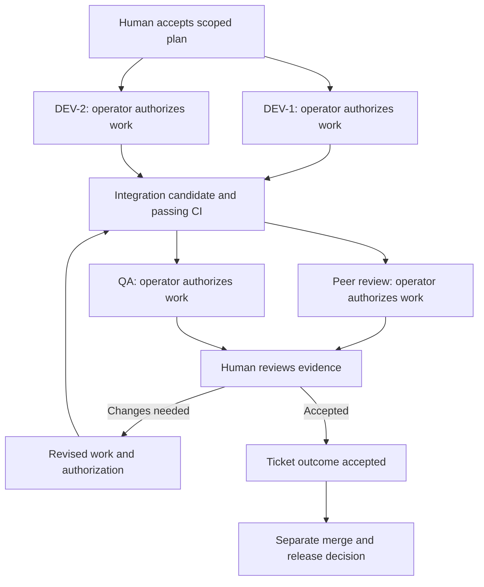

# Operating model

Status: proposed. Terms and transitions here are the product contract for this design.

## Identity and responsibility

| Entity | Meaning | Example |
| --- | --- | --- |
| Human | Authenticated member with accountable decisions | Prashant |
| Agent profile | Server-issued persistent UUID; mandatory human operator; approved project and role bindings | `DEV-1`, a display alias |
| Connection | One enrolled client installation/session, credentials, runtime capabilities and last contact | DEV-1 on a laptop in VS Code |
| Work item | One scoped contribution under a human-owned ticket, assigned to one role | Implement the notification API |
| Attempt | One execution of one approved work-item revision | Third attempt by DEV-1 |
| Artifact | Immutable submitted output or evidence linked to an attempt and source revision | Commit, test report or design document |

Keep three human responsibilities distinct: the **ticket owner** owns the outcome; the **agent operator** authorizes use of their agent; the **reviewer** accepts the contribution. A release approver authorizes a release separately. One person may fill several positions where project policy permits it.

The **project context steward**, initially the project owner, publishes accepted requirements and resolves context conflicts. A solutions architect or context-review agent may assist through proposals. Automatically observed repository facts do not require manual rewriting, while changes to accepted intent require a human decision. See [Project context](PROJECT_CONTEXT.md).

Agent profiles show alias, operator, role bindings, projects, runtime/model metadata, connection status, capacity, active work and recent accepted contributions. Server-issued IDs survive restarts. A new session is not a new agent. A new device gets its own connection and credential. Model identity supplied by a client is marked as reported, not independently verified.

A role belongs to a workspace and is enabled for specific projects. A profile may have multiple roles but an attempt has exactly one active role. Roles describe expected work; action permissions are explicit grants. Adding the name “administrator” to a role grants nothing.

## Role presets

| Role | Typical contribution | Boundary |
| --- | --- | --- |
| Product / business analysis | Clarify requirements and acceptance examples | Human decides scope and priority |
| Solutions architect | Design boundaries, contracts and migration plan | Human accepts architecture and policy changes |
| Developer | Implement the approved change and focused tests | Cannot accept its own contribution |
| Peer reviewer | Examine correctness, maintainability and risks | Findings are recommendations with evidence |
| QA | Validate acceptance criteria and regression behavior | Cannot turn a failing gate into a pass |
| Security reviewer | Examine threats, permissions and exposure | Exceptions require a designated human |
| UX / accessibility | Propose interaction and accessibility changes | Human accepts product tradeoffs |
| Release / operations | Prepare release, rollout and recovery evidence | Merge and deployment require separate authority |
| Documentation | Update user and developer documentation | Cannot rewrite trusted execution policy |
| Performance / data specialist | Measure and propose targeted improvements | Cannot widen data access or spend |

UAT is a separate business-scenario contribution with final acceptance owned by a business human. The [role catalog](ROLE_CATALOG.md) provides eleven specialized prompts, initialization and explicit file/action boundaries. Every agent declares its responsibilities and what is outside its role before substantive authorized work.

Frontend, backend and full-stack developer are optional specializations. Projects may define additional roles using the same contract; no custom workflow programming is needed for the first release.

Three providers can back five profiles, for example SA-1, DEV-1, DEV-2, REVIEW-1 and QA-1. Provider choice is independent of role. Do not label a provider as inherently the best architect or reviewer. Let humans select using approved capabilities and availability.

## Work hierarchy and routing

A human ticket describes an outcome. An accepted plan contains bounded work items and dependencies. Each work item has a role, acceptance criteria, an accountable human, a current assignment and attempts. Attempts produce artifacts; decisions refer to exact artifact versions.

An agent-created ticket starts as a **proposal**, visible in the same human queue with its author and suggested role. It links the current context, relevant requirement or new-scope request, evidence of the gap and related work/PRs. Stride checks duplicate candidates and scope before a human accepts or edits it into a normal ticket. An agent can propose child work and role assignments, but cannot expand the accepted plan or authorize the next agent to execute it. Within an accepted plan, Stride can materialize its approved work items automatically.

Stride lists eligible profiles and an authorized human manually selects one. Eligibility requires project membership and grants, the role, repository/runtime capability, remaining capacity and applicable limits. The architect may recommend a profile, but cannot assign or start it. An offline or busy profile is shown as unavailable. No selection leaves the work visibly queued. Notify the selected profile's operator; automatic selection, reassignment and autonomous starts are deferred.

The operator sees a short review: objective, repository, permitted changes, expected output, limits and why their agent was selected. They can **Start**, **Edit scope**, **Decline**, or, with assignment authority, **Choose another eligible agent**. Otherwise they can request reassignment. Scope changes require the relevant scope owner before a revised start decision; an operator cannot enlarge accepted work merely by editing this form. Start records an authorization and then opens or launches the supported client. On a client without launch support it shows the packet and a suggested instruction to give the agent. No hidden automatic execution follows assignment alone.

## Workflow templates

Small fix: development, focused validation, human review and acceptance. Optional specialist review depends on risk. Solo mode can use one agent in successive roles, with a clear “same agent reviewed its own work” label and human review. Separate sessions or different model names do not prove independent review.

Standard software delivery follows [Human-approved delivery](HUMAN_APPROVED_DELIVERY.md): accepted BA requirements and solution/plan, development, candidate-bound engineering review, QA, verified UAT, business-human acceptance and separate release/production closure. Reuse accepted project baselines; add specialists according to risk. The diagram below shows the contribution review pattern, not the full software-delivery completion policy.

The default software-delivery policy admits a candidate to QA after the engineering human's gate. A separately approved workflow may collect independent review/QA evidence concurrently as illustrated, but must preserve each required human gate before UAT. Human contribution acceptance in the diagram is not production completion.

Parallel developers need separate workspaces, agreed interfaces and compatible scopes. Assign an integration owner. Review and QA target the integrated commit, not two incompatible branch heads. A later commit makes earlier candidate approvals stale. Security-sensitive changes add specialist evidence and the required human authority before acceptance.

Every downstream assignment follows the operator-start rule. To reduce repeated clicks, an operator may approve an explicit bundle of frozen work packets for their own profiles. Dependency gates still apply. Approval does not cover future tasks or revisions; expired approval is requested again when the work becomes ready.

## State model

The existing ticket statuses stay **To do, In progress, Done**. For tickets with agent work, Done requires a human acceptance decision for the current outcome and required gates. A direct status edit, bulk action, recurrence completion or alternate API must use that same guard. Agent submission cannot complete the parent ticket. For opted-in software-delivery tickets, the selected completion policy additionally requires verified production delivery and human closure; a BA/design/document contribution can be accepted at its own artifact gate. Delivery stage, role work state, attempt state and waiting reason remain separate. Legacy tickets without agent work keep their normal flow.

| Work-item state | Meaning | Permitted next state |
| --- | --- | --- |
| `proposed` | Suggested work awaiting plan/scope acceptance | `ready`, `cancelled` |
| `ready` | Accepted scope; waiting for dependencies, operator approval or capacity as needed | `in_progress`, `cancelled` |
| `in_progress` | A valid attempt has started | `in_review`, `ready`, `cancelled` |
| `in_review` | Submitted contribution awaiting required validation and human review | `accepted`, `ready`, `cancelled` |
| `accepted` | Human accepted the current revision and evidence | Terminal for this revision |
| `cancelled` | Work withdrawn; active execution stop requested separately | Terminal for this revision |

“Ready” denotes accepted scope, not permission to execute. Store a separate waiting reason: dependencies, operator decision, no eligible agent, capacity, runner offline, clarification, budget or reviewer decision. An attempt has its own lifecycle: starting, running, waiting for human input, paused, submitted, failed, cancel requested, cancelled or lease lost. Returning work to ready records why and never reuses an old attempt authorization.

Accepted work is immutable evidence. Reopening the outcome creates a new revision and any necessary work; it invalidates downstream decisions that relied on the replaced candidate. A task archive requests cancellation, revokes future writes and retains the execution-stop status until known.

## Human experience

**My decisions** combines start requests, agent questions, scope changes and results. Group related notices by ticket and decision. Clearly separate “Approve work” from “Accept result.” Preserve drafts after conflicts and show when a request was superseded. Do not generate a notification for every tool call or heartbeat.

**Ticket view** presents outcome and owner first, then agent contributions, blockers, evidence, decisions and a concise timeline. A card could read: “DEV-1 · operated by Prashant · In progress · last contact 20 seconds ago · 3 of 5 acceptance checks demonstrated.” “Tests passed” must link to a report; agent-reported results have an explicit label.

**Team and agents** shows connected, busy, paused, offline or revoked profiles. A connected client is not necessarily an available executing agent. Show the real reason work is waiting and which human can resolve it.

**Project brief** shows accepted goals, exclusions, adopted decisions, verified code baselines and active work. It highlights source freshness, disputed requirements, externally observed GitHub changes and proposed missing work. A task explains “Why this work?” using its requirement/evidence links. Per-attempt context badges distinguish current, needs refresh, conflicting and unavailable input; connected does not imply current context.

**IDE/CLI** delivers a concise private notice and a link to the authenticated decision. The VS Code extension can host a queue; unsupported IDEs use the companion terminal and browser. Notification previews omit sensitive ticket content by default. Quiet hours delay ordinary notices, not expiration or revocation enforcement. Email is optional; the initial flow works with the in-app inbox and companion.

Progress uses acceptance checks, artifacts and completed gates. Distinguish agent-reported, server-observed, CI-verified and human-accepted evidence. Do not fabricate completion percentages, billing figures or ETAs. Do not collect hidden reasoning or complete private agent conversations for the human dashboard.

Switching machines uses a published structured checkpoint and a fresh validation/authorization step. Unshared local edits remain explicitly unavailable. A newer requirement or conflicting local instruction is a decision to resolve, never permission to silently change the task.
